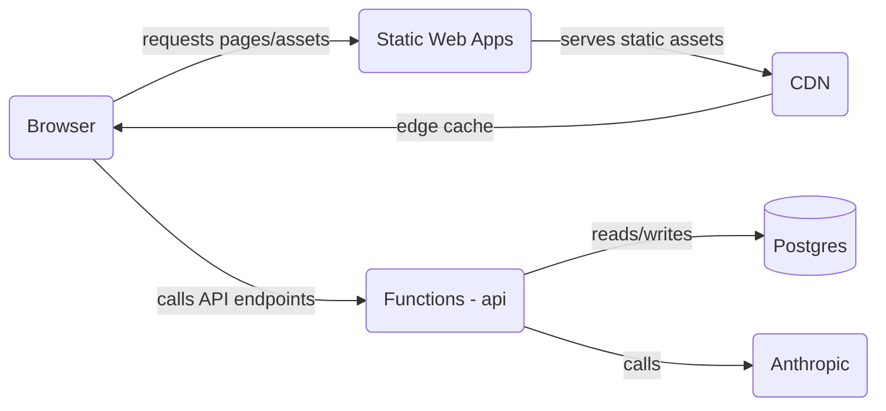
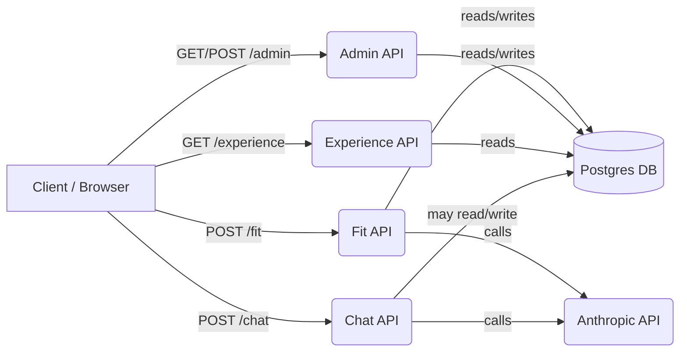
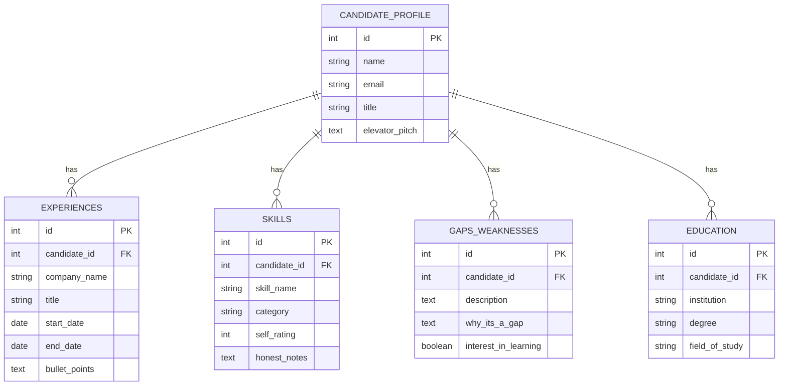

# me — AI-assisted portfolio (developer-focused README)

Purpose
- Personal portfolio site with AI-assisted admin and analysis features.
- Static frontend served by Azure Static Web Apps and serverless APIs implemented as Azure Functions (Node.js).

Quick links
- Admin UI client: assets/js/admin.js
- Experience UI client: assets/js/experience-ai.js
- Fit/Analyzer client: assets/js/fit-ai.js and assets/js/fit-analyzer.js
- Server handlers: api/
- DB schema: db/

## Architecture Diagram



Architecture Diagram

Prerequisites
- Node.js 20+ and npm
- GNU Make
- PostgreSQL client tools (psql, pg_dump)
- (Optional) Azure CLI for deployment

Environment (local)
- Copy and fill `.env.local` from `.env.local.example` (DO NOT commit secrets).
- Key env vars:
  - `DATABASE_URL` — Postgres connection (SSL recommended)
  - `ANTHROPIC_API_KEY` — AI provider key
  - `AI_MODEL` — model id (default used in code)
  - `FUNCTIONS_WORKER_RUNTIME=node`

Start local dev stack
- Start everything (SWA emulator + Functions):

```bash
make start
```

Database management
- `make backup-db` — create a SQL dump of the current database into `db/backup-<timestamp>.sql`. Uses `DATABASE_URL` from `.env.local`.
- `make deploy-db` — runs the full deployment workflow (pre/post schema dumps, migrations, verification). Review `Makefile` and ensure `.env.local` is configured before running.

Quick commands:

```bash
# create a timestamped backup
make backup-db

# run full DB deployment workflow (use with caution)
make deploy-db
```

- Stop local stack:

```bash
make stop
```

Open these pages in your browser once the emulator is running:

- Admin UI: http://127.0.0.1:4280/admin.html
- Experience UI: http://127.0.0.1:4280/experience-ai.html
- Fit / Analyzer: http://127.0.0.1:4280/fit-ai.html

Development notes
- Frontend is served as static files; `assets/js` contains the client code (no frontend build step required).
- The `dist/` directory contains bundled/minified artifacts used on some static pages; `assets/js` is the authoritative source during development.
- The admin UI performs draft autosaves to `localStorage`; use the Admin page to persist changes to the DB.

Testing & quality checks
- Run the project quality pipeline (spellcheck, API unit tests, link checks):

```bash
make check
```

- Run only API unit tests:

```bash
cd api && npm test -- --runInBand
```

API surface (high level)
- `GET /api/experience` — returns profile, experiences, `skills` (strong/moderate/gap). `gaps` returned to the client include `interestedInLearning` boolean.
- `GET/POST /api/admin` — admin panel data and save endpoint (requires authentication in production).
- `POST /api/fit` — JD analysis endpoint (server-side AI-backed analysis). This endpoint consolidates the previous `/api/fit-check` behaviour; `/api/fit-check` has been removed. Request body must include `jobDescription`.
- `POST /api/chat` — chat endpoint that proxies prompts to AI with caching.

**API Diagram**




**DB ER Diagram**

