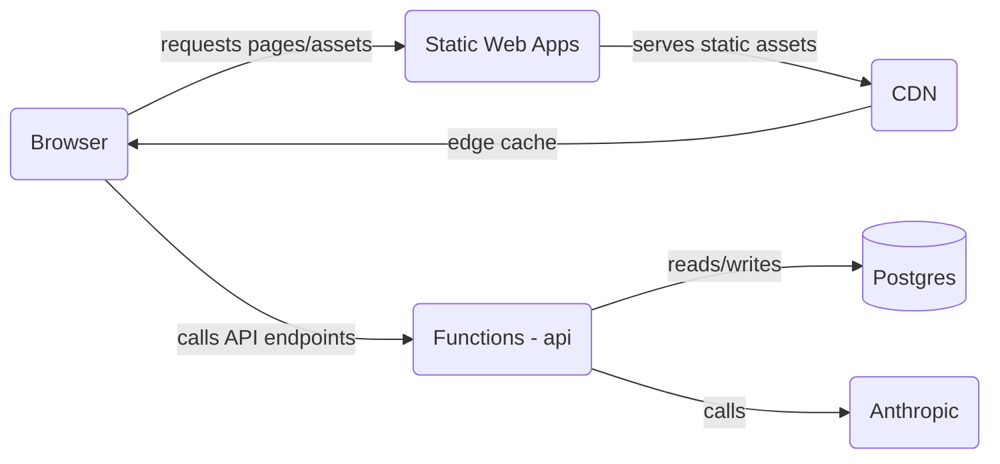

# me — AI-assisted portfolio (developer-focused README)

Purpose
- Personal portfolio site with AI-assisted admin and analysis features.
- Static frontend served by Azure Static Web Apps and serverless APIs implemented as Azure Functions (Node.js).
- Prompt engineering composes a detailed, context-rich prompt from a candidate's profile, experience, education, certifications, skills, FAQ, and custom instructions.
- Support for per-candidate instruction overrides (tone, honesty, boundaries) to tune assistant behavior.
- Deterministic client-side analyzers extract transferable skills, education matches, and gaps from job descriptions without invoking an LLM.
- Server-side orchestration prepares prompts and invokes models, with a response cache to avoid redundant calls.
- Design focuses on concise, honest assistant responses and preserves user-controlled overrides and privacy-conscious caching.

Features
- Admin interface for editing and publishing candidate profile data.
- Experience viewer with AI-generated role context for resume items.
- Fit/Analyzer tools for comparing job descriptions to a profile and identifying transferable skills and gaps.
- Serverless HTTP APIs that assemble profile context, run deterministic analyzers, and proxy prompts to an AI model with caching.
- PostgreSQL-backed schema for profile, experiences, skills, education, certifications, and AI instruction overrides.

## Architecture Diagram



Architecture Diagram

- Prerequisites
- Node.js (tested on 20+) and npm
- GNU Make
- Azure SQL tools: `sqlcmd` and `sqlpackage` (for backups/restore). Alternatively, you can run DB commands with a Node script using the `mssql`/`tedious` packages.

Environment (local)
- Copy and fill `.env.local` from `.env.local.example` (DO NOT commit secrets).
-- Key env vars:
  - `AZURE_DATABASE_URL` — Database connection string used by local tooling. Provide either an ADO-style connection string (suitable for `sqlpackage`/`sqlcmd`), for example:
    `Server=tcp:myhost.database.windows.net,1433;Initial Catalog=mydb;User ID=myuser;Password=secret;Encrypt=true;TrustServerCertificate=false;`
    or a `sqlserver://...;key=val;...` form.
  - `ANTHROPIC_API_KEY` — AI provider key (required for AI-backed endpoints; missing this will cause AI endpoints to return 500 errors)
  - `AI_MODEL` — model id (optional override)
  - `FUNCTIONS_WORKER_RUNTIME=node`

Start local dev stack
- Start everything (SWA emulator + Functions):

```bash
make start
```

Database management
- `make backup-db` — export the current database. For Azure SQL this will export a `.bacpac` using `sqlpackage`. `make backup-db` prefers an ADO-style connection string from `DATABASE_ADO` in `.env.local` (recommended for `sqlpackage`); if `DATABASE_ADO` is not present it falls back to `AZURE_DATABASE_URL`. For other workflows, use a Node-based export script or the Azure portal. Ensure one of these is set in `.env.local`.
- `make deploy-db` — runs the full deployment workflow (pre/post schema dumps, migrations, verification). Review `Makefile` and ensure `.env.local` is configured before running.

Quick commands:

```bash
# create a timestamped backup
make backup-db

# run full DB deployment workflow (use with caution)
make deploy-db
```

- Stop local stack:

```bash
make stop
```

Open these pages in your browser once the emulator is running:

- Admin UI: http://127.0.0.1:4280/admin.html
- Experience UI: http://127.0.0.1:4280/experience-ai.html
- Fit / Analyzer: http://127.0.0.1:4280/fit-ai.html

Development notes
- Frontend is served as static files; `assets/js` contains the client code (no frontend build step required).
- The `dist/` directory contains bundled/minified artifacts used on some static pages; `assets/js` is the authoritative source during development.
- The admin UI performs draft autosaves to `localStorage`; use the Admin page to persist changes to the DB.

Testing & quality checks
- Run the project quality pipeline (spellcheck, unit tests, link checks, linter, etc.):

```bash
make check
```

- Run only unit tests:

```bash
make unit-test
```

Implementation details are in `docs/DESIGN.md`.
