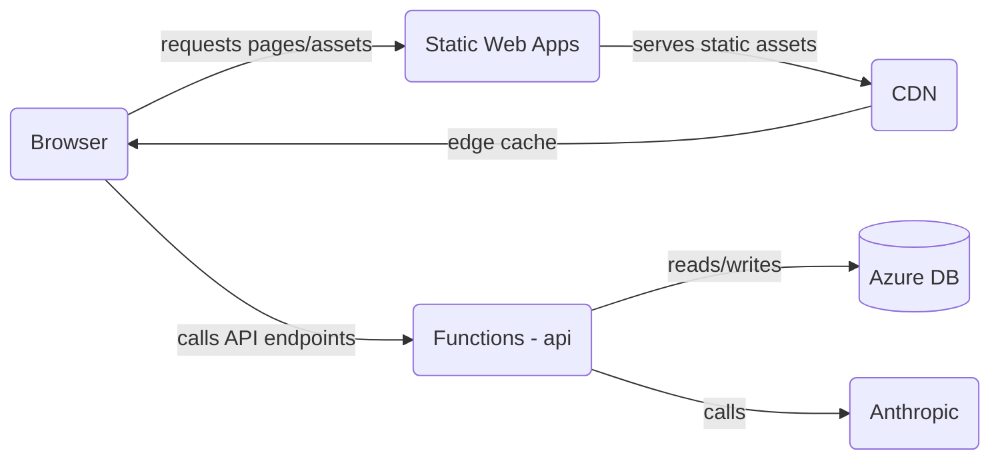

# me — AI-assisted portfolio & job-fit analyzer

An interactive portfolio site that uses AI to help job seekers and hiring managers quickly determine fit. Upload a job description and get an instant, honest assessment of how your skills, experience, and values align — plus an AI assistant trained on your profile that answers questions directly.

## Features

**For job seekers:**

- **Fit Analyzer** — Upload a job description and instantly see how your skills, experience, and values match (without hitting the LLM)
- **Honest AI Chat** — Ask questions about yourself. The AI assistant is trained on your profile but configured to be brutally honest, not oversell
- **Experience Context** — Privately store the real story behind each role (why you joined, what you learned, challenges faced) that the AI uses to give authentic answers
- **Custom AI Instructions** — Set tone, boundaries, and specific guidance for how the assistant should represent you

**For admins:**

- **Profile Editor** — Manage your experience, skills, education, certifications, and custom instructions in one place
- **Eval Tools** — Built-in testing and eval framework for fit accuracy and chat quality

## Tech Stack

- **Frontend:** React (with TypeScript, migration in progress), vanilla JS with no build step for static pages
- **Backend:** Node.js serverless (Azure Functions), prompt engineering with Anthropic Claude
- **Database:** Azure SQL / PostgreSQL with schema migrations
- **Infrastructure:** Azure Static Web Apps, CDN, distributed cache for AI responses
- **Testing:** Unit tests, integration tests, and an eval framework for prompt/output validation

## Getting Started

### Live Demo

- Visit the [deployed portfolio](https://devgoon.com) to see it in action
- Try the Fit Analyzer by uploading a job description
- Chat with the AI to ask questions

### Local Development

1. Clone the repo and install dependencies:

   ```bash
   npm install
   ```

2. Copy `.env.local.example` to `.env.local` and fill in required vars:

   - `AZURE_DATABASE_URL` — database connection
   - `ANTHROPIC_API_KEY` — Claude API key
   - `VITE_SCHEDULE_MEETING_URL` — (optional) booking link shown when a role is a fit

3. Start the dev stack:

   ```bash
   make start
   ```

   This runs the SWA emulator, Azure Functions, and React dev server.

4. Open your browser:
   - Admin UI: http://127.0.0.1:4280/admin.html
   - Experience Viewer: http://127.0.0.1:4280/experience.html
   - Fit Analyzer: http://127.0.0.1:4280/fit.html

## Design Principles

- **Honesty over selling** — the AI is instructed to tell the truth about fit, not oversell
- **User control** — you own your profile data and can override AI behavior via custom instructions
- **Privacy-conscious** — responses are cached server-side; no personal data sent to third-party analytics
- **Deterministic where possible** — skill matching and gap detection runs client-side without invoking an LLM

## For Developers

### Architecture


```mermaid
flowchart LR
  Browser(Browser)
  SWA(Static Web Apps)
  Functions(Functions - api)
  DB[(Azure DB)]
  AI(Anthropic)
  CDN(CDN)

  Browser -->|requests pages/assets| SWA
  Browser -->|calls API endpoints| Functions
  SWA -->|serves static assets| CDN
  Functions -->|reads/writes| DB
  Functions -->|calls| AI
  CDN -->|edge cache| Browser
```

**How it works:**

- Frontend is served as static files (no build step required); React components are in `frontend-react/` for new UIs
- Backend APIs (`api/` folder) assemble candidate context from the database and compose detailed prompts for Claude
- Responses are cached by model + question hash to avoid redundant API calls
- Fit analyzer runs deterministic algorithms client-side (skill extraction, gap detection) without invoking an LLM

### Prerequisites

- Node.js 22+ and npm
- GNU Make
- (Optional) Azure SQL tools (`sqlcmd`, `sqlpackage`) for database admin tasks

### Environment Setup

Copy `.env.local` from `.env.local.example` and fill in:

| Variable                    | Purpose                                                                   |
| --------------------------- | ------------------------------------------------------------------------- |
| `AZURE_DATABASE_URL`        | Database connection (ADO or `sqlserver://` format)                        |
| `ANTHROPIC_API_KEY`         | Claude API key                                                            |
| `ADMIN_DATABASE_ADO`        | Admin connection for backup/migration tasks (optional)                    |
| `AI_MODEL`                  | Override default Claude model (optional)                                  |
| `VITE_SCHEDULE_MEETING_URL` | Booking URL shown on job fit verdicts (optional, must start with `VITE_`) |

### Running Locally

```bash
# Start everything (SWA emulator + Functions + React dev server)
make start

# Stop the stack
make stop
```

Open your browser to the endpoints listed in the "Getting Started" section above.

### Database Management

```bash
# Create a timestamped backup
make backup-db

# Run full deployment workflow (schema dump → migrate → verify)
make deploy-db
```

Requires `ADMIN_DATABASE_ADO` in `.env.local`.

### React Frontend

The React version in `frontend-react/` is under migration. Use these commands:

```bash
npm run react:dev          # Start dev server (hot reload)
npm run react:build        # Build production bundle
npm run react:build:watch  # Rebuild on file changes
npm run react:preview      # Preview production build
```

`make start` includes React watch mode automatically.

### Testing & Quality

```bash
# Run full quality pipeline (unit tests, linter, spellcheck, link checks)
make check

# Run only unit tests
make unit-test

# Run prompt/output evals (Jest-based)
npm run test:evals:jest

# Export chat cache for eval analysis
npm run evals:export:chat-cache -- --limit 100 --min-hits 2
npm run evals:export:chat-cache -- --only-active  # Active entries only
```

**Evaluating model outputs:**

```bash
EVAL_MODEL_OUTPUTS_PATH=./path/to/model-outputs.json npm run test:evals
EVAL_CHAT_OUTPUTS_PATH=./path/to/chat-outputs.json npm run test:evals
```

See `docs/DESIGN.md` for implementation details.
