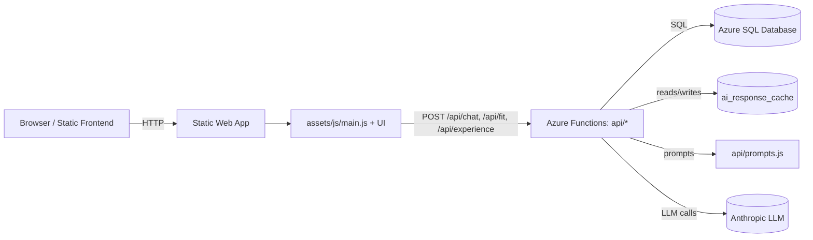
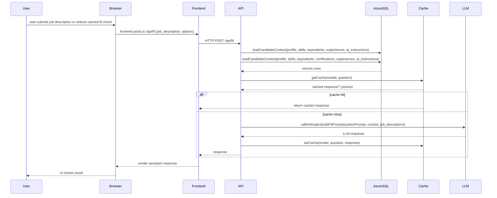
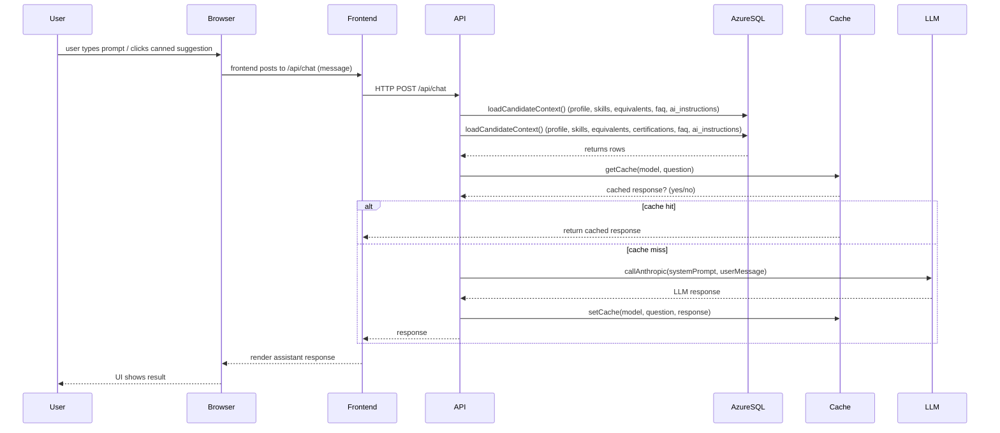

## Design Overview

**Purpose:** Describe the high-level architecture, data flows, security and operational considerations for the `me` site, focusing on LLM integration, prompt centralization, caching, and CI quality gates.

**Scope:** frontend static site + Azure Functions API (chat/fit/experience), Azure SQL Database (managed), ai_response_cache, prompt builders (`api/prompts.js`), and the Anthropic LLM provider.

**Platform & Stack (concrete)**
- Frontend: React 19, Vite, MUI (@mui/material), `@tanstack/react-query` v5
- Tests: Vitest, @testing-library/react, @testing-library/user-event, Playwright (E2E)
- API: Azure Functions (Node.js 22+), centralized prompts in `api/prompts.js`
- DB: Azure SQL (connection via `AZURE_DATABASE_URL`)

---

**Architecture (high-level)**

**Key components**

- Frontend: client-side React single-page app (Vite-built), served by SWA; the UI communicates with `/api/*` endpoints.
- API: Azure Functions endpoints in `api/` (chat, fit, experience). Centralized prompt builders live in `api/prompts.js`.
- DB: Azure SQL Database (managed) holds the following tables: `candidate_profile`, `skills`, `skill_equivalence`, `experiences`, `education`, `certifications`, `faq_responses`, `values_culture`, `gaps_weaknesses`, `ai_instructions`, `ai_response_cache`.

---
 
## Frontend

- **Pages:**
  - **Home:** Candidate overview and entry point; shows a short `elevator_pitch`, high-level score cards, and quick actions (Ask AI, Run Fit Check).
  - **Experience & Skills:** Loads a static/compact snapshot first (fast-rendered JSON embedded or fetched as a small payload) so the UI is usable immediately; then the page hydrates and fetches the full, canonical candidate rows (experiences, skills, equivalences, certifications, education) via `@tanstack/react-query` to render expanded details and edit controls. The initial static-data-first approach reduces TTI and improves perceived performance while allowing richer dynamic interactions once the detailed data arrives.
  - **Chat / Ask AI:** Conversational UI that posts to `/api/chat`; uses React state + React Query for history and cached assistant responses. Supports follow-up queries and threaded context.
  - **Fit Check:** Form-based flow where the user provides a job description (or selects a canned one) and the UI posts to `/api/fit`; results render as structured JSON translated into UI cards (score, verdict, reasons, suggestedMessage).
  - **Admin:** Admin tooling pages for cache inspection, cache invalidation, and population/bootstrap operations. Admin pages call `/api/admin/*` and render server-side status and job progress.
  - **Auth / Account:** Login, logout, and developer feature toggles. Local development uses `api/local.settings.json` and example env files.
  - **Health / Diagnostics:** Small pages used by monitoring and E2E tests to assert the app and API health endpoints.

- **Rendering model:** The frontend is a client-side single-page application (Vite + React). Routes are client-rendered (React Router style), initial HTML is minimal, and hydration/data fetching is handled on the client. Pages use `@tanstack/react-query` v5 to fetch and cache API data; common patterns include:
  - Static-first quick render: small JSON or minimal payload to show the page synchronously, then background React Query fetch to hydrate richer content.
  - Shared QueryClient across the app and in tests to avoid duplicated caches and update coordination.
  - UI components that depend on larger context (Experience, Skills) initially render compact summaries and progressively render full details when the detailed query resolves.
  - Optimistic updates and cache invalidation hooks exist for edits (skills/experiences) to reflect local changes quickly and then reconcile with server responses.

- **Data flow & caching:** The frontend treats the API as the source of truth. Data is requested from `/api/*` endpoints; caching and deduping are handled by React Query on the client and `ai_response_cache` on the server for LLM responses (chat). Tests should use a shared `createQueryClient()` test wrapper so components under test observe the same cache semantics.

## Fit Check

Form-based flow where the user provides a job description (or selects a canned one) and the UI posts to `/api/fit`; results render as structured JSON translated into UI cards (score, verdict, reasons, suggestedMessage).

### Fit Check Request Sequence

## Prompting & Privacy

- Centralized prompt builders: `api/prompts.js` — all prompt text and helper logic lives here to make tuning and audits straightforward.
- Prompt length guard: code trims equivalents or other optional context when prompt size exceeds configured chars (to avoid token limits).
- Sensitive fields: salary and contact details should NOT be included in prompts. Existing code was audited — `target_titles` is included per request, but `salary_min` / `salary_max` are not included. Redact any sensitive profile fields before logging or caching.

## Secrets & Key Management

- Store runtime secrets in CI/repo secret stores.  Do not store secrets in plaintext files in the repository.
- Keep local example files for developer setup: `api/local.settings.json.example`, `.env.local.example` and ensure actual local files are listed in `.gitignore`.
- In CI, inject secrets via environment variables or vault integrations and avoid baking keys into build artifacts.
- If secrets were ever committed, coordinate an immediate rotation of the exposed keys and, if necessary, perform a history-rewrite.
- For tests, mock external secrets and LLM calls; provide example env files and a test fixture helper to safely set/restore `process.env` during suites.

## Caching Strategy

This section consolidates caching behavior, keys, invalidation, and operational guidance.

## Database Schema (ER diagram)

## Frontend

- **Pages:**
  - **Home:** Candidate overview and entry point; shows a short `elevator_pitch`, high-level score cards, and quick actions (Ask AI, Run Fit Check).
  - **Experience & Skills:** Loads a static/compact snapshot first (fast-rendered JSON embedded or fetched as a small payload) so the UI is usable immediately; then the page hydrates and fetches the full, canonical candidate rows (experiences, skills, equivalences, certifications, education) via `@tanstack/react-query` to render expanded details and edit controls. The initial static-data-first approach reduces TTI and improves perceived performance while allowing richer dynamic interactions once the detailed data arrives.
  - **Chat / Ask AI:** Conversational UI that posts to `/api/chat`; uses React state + React Query for history and cached assistant responses. Supports follow-up queries and threaded context.
  - **Fit Check:** Form-based flow where the user provides a job description (or selects a canned one) and the UI posts to `/api/fit`; results render as structured JSON translated into UI cards (score, verdict, reasons, suggestedMessage).
  - **Admin:** Admin tooling pages for cache inspection, cache invalidation, and population/bootstrap operations. Admin pages call `/api/admin/*` and render server-side status and job progress.
  - **Auth / Account:** Login, logout, and developer feature toggles. Local development uses `api/local.settings.json` and example env files.
  - **Health / Diagnostics:** Small pages used by monitoring and E2E tests to assert the app and API health endpoints.

- **Rendering model:** The frontend is a client-side single-page application (Vite + React). Routes are client-rendered (React Router style), initial HTML is minimal, and hydration/data fetching is handled on the client. Pages use `@tanstack/react-query` v5 to fetch and cache API data; common patterns include:
  - Static-first quick render: small JSON or minimal payload to show the page synchronously, then background React Query fetch to hydrate richer content.
  - Shared QueryClient across the app and in tests to avoid duplicated caches and update coordination.
  - UI components that depend on larger context (Experience, Skills) initially render compact summaries and progressively render full details when the detailed query resolves.
  - Optimistic updates and cache invalidation hooks exist for edits (skills/experiences) to reflect local changes quickly and then reconcile with server responses.

- **Data flow & caching:** The frontend treats the API as the source of truth. Data is requested from `/api/*` endpoints; caching and deduping are handled by React Query on the client and `ai_response_cache` on the server for LLM responses (chat). Tests should use a shared `createQueryClient()` test wrapper so components under test observe the same cache semantics.
The following Mermaid ER diagram summarizes the primary tables and relationships used for candidate context, skills/equivalences, and the AI response cache.

## AI Prompt Contexts

This section documents what contextual data each AI prompt type includes when calling the LLM. All context is assembled server-side in the API layer (api/fit/index.js` and `api/chat/index.js`) and passed into centralized prompt builders in `api/prompts.js`.

### Chat (/api/chat)

Context included:

- `profile`: `id`, `name`, `title`, `elevator_pitch` (short summary)
- `skills`: skill names, categories and optionally `equivalents` (compact string form)
- `faq` / `faq_responses`: common Q&A entries (short answers)
- `ai_instructions`: high-priority per-candidate instructions (text)
- `target_titles`: job titles the candidate is targeting (when present)
- `recent_activity`: brief indicators (recent roles or highlights) — compacted

Usage:

- Used for conversational assistant UI (Ask AI). Prompts favor brevity; include only the most relevant profile snippets and FAQ items. The chat path is tolerant of conversational follow-ups and may pass dialog history plus a compact candidate context to the prompt builder.

Cache behavior:
- The `/api/chat` handler checks `ai_response_cache` first. Cache keys are computed as SHA-256 over `model + '|' + message` (the user message). On a cache miss the service loads the candidate context, builds the prompt with `api/prompts.js`, calls the LLM, and writes the assistant response into `ai_response_cache` keyed by the model+message hash.

### Fit Check (/api/fit)

Context included:

- `profile`: `id`, `name`, `title`, `elevator_pitch`
- `skills`: full skill rows (category, self_rating, equivalents)
- `experiences`: condensed experience records (company, title, dates, notable bullets)
- `certifications` and `education` (optional context)
- `gaps_weaknesses`: descriptions and interest flags
- `values_culture` (must_haves / dealbreakers)
- Job description or `job_description` payload provided by the user
- `ai_instructions` and any per-request tuning options (temperature, length)

Usage:

- Used to evaluate candidate fit for a specific role. Prompt includes the job description and compares candidate skills/experiences. Responses are structured JSON with these keys: `score` (integer 0–100), `verdict` (one of `FIT`, `MARGINAL`, `NO FIT`), `reasons` (array of short strings), `mismatches` (array of short strings), and `suggestedMessage` (a concise one-paragraph message the candidate could send to a recruiter).

