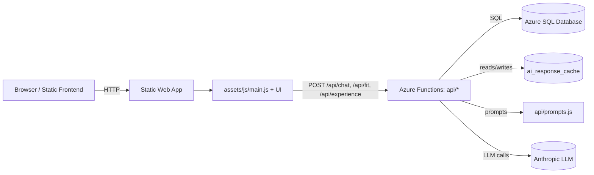
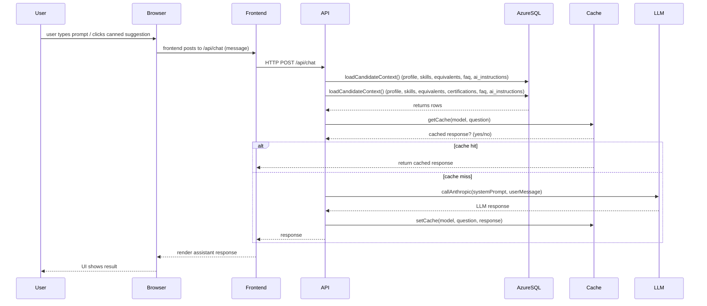
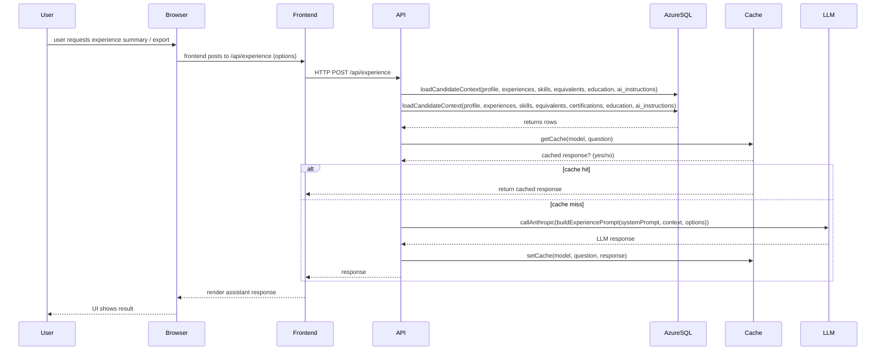
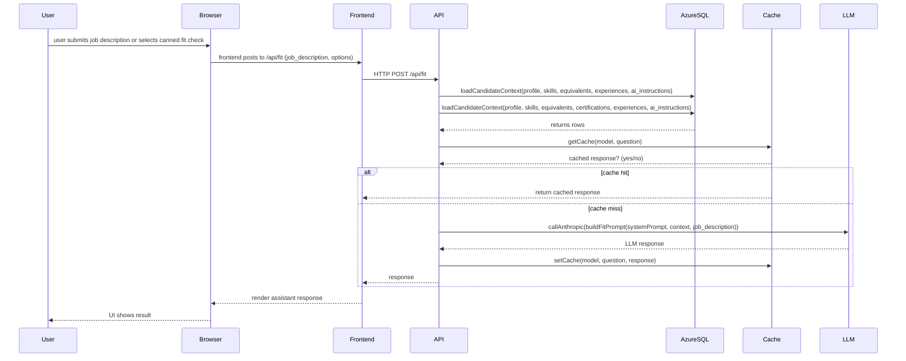

## Design Overview

**Purpose:** Describe the high-level architecture, data flows, security and operational considerations for the `me` site, focusing on LLM integration, prompt centralization, caching, and CI quality gates.

**Scope:** frontend static site + Azure Functions API (chat/fit/experience), Azure SQL Database (managed), ai_response_cache, prompt builders (`api/prompts.js`), and the Anthropic LLM provider.

---

**Architecture (high-level)**

**Key components**

- Frontend: static pages, UI wires to `/api/*` endpoints in `assets/js/*`.
- API: Azure Functions endpoints in `api/` (chat, fit, experience). Centralized prompt builders live in `api/prompts.js`.
- DB: Azure SQL Database (managed) holds `candidate_profile`, `skills`, `skill_equivalence`, `ai_response_cache`, etc. Use the `AZURE_DATABASE_URL` connection string and enable transient fault retry/backoff logic appropriate for Azure SQL.

---

## Request Sequence

This sequence shows a typical chat request lifecycle.

### Experience Request Sequence

### Fit Check Request Sequence

## Prompting & Privacy

- Centralized prompt builders: `api/prompts.js` — all prompt text and helper logic lives here to make tuning and audits straightforward.
- Prompt length guard: code trims equivalents or other optional context when prompt size exceeds configured chars (to avoid token limits).
- Sensitive fields: salary and contact details should NOT be included in prompts. Existing code was audited — `target_titles` is included per request, but `salary_min` / `salary_max` are not included. Redact any sensitive profile fields before logging or caching.

## Caching

- Cache entries keyed by SHA-256(model + "|" + question).
- On cache hit: update `cache_hit_count` and `last_accessed`.
- Cache invalidation: manual invalidation endpoint exists (`/api/cache-report` usage); consider TTL-based expiry for long-term scaling.

## Database Schema (ER diagram)

The following Mermaid ER diagram summarizes the primary tables and relationships used for candidate context, skills/equivalences, and the AI response cache.

