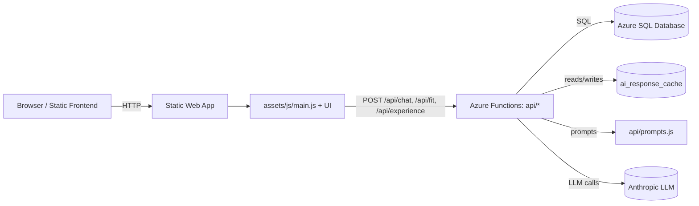
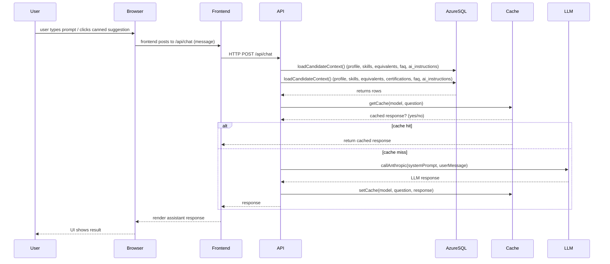
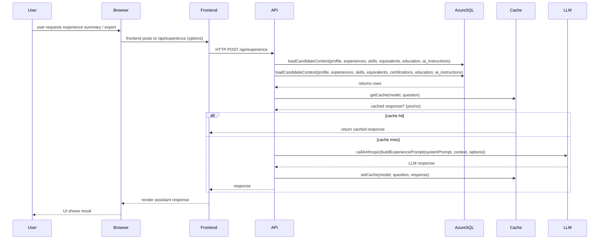
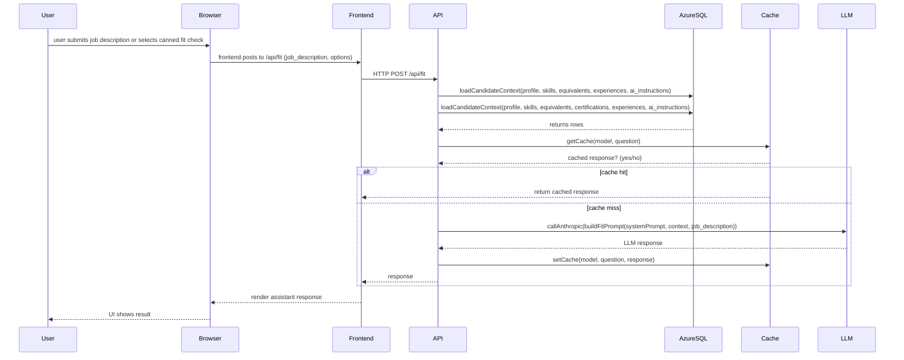
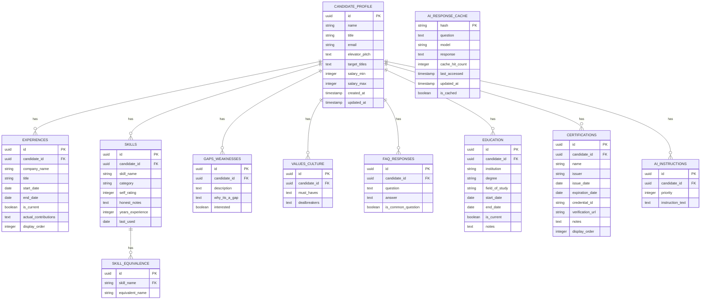

## Design Overview

**Purpose:** Describe the high-level architecture, data flows, security and operational considerations for the `me` site, focusing on LLM integration, prompt centralization, caching, and CI quality gates.

**Scope:** frontend static site + Azure Functions API (chat/fit/experience), Azure SQL Database (managed), ai_response_cache, prompt builders (`api/prompts.js`), and the Anthropic LLM provider.

**Platform & Stack (concrete)**
- Frontend: React 19, Vite, MUI (@mui/material), `@tanstack/react-query` v5
- Tests: Vitest, @testing-library/react, @testing-library/user-event, Playwright (E2E)
- API: Azure Functions (Node.js 22+), centralized prompts in `api/prompts.js`
- DB: Azure SQL (connection via `AZURE_DATABASE_URL`)

---

**Architecture (high-level)**

**Key components**

- Frontend: static pages, UI wires to `/api/*` endpoints in `assets/js/*`.
- API: Azure Functions endpoints in `api/` (chat, fit, experience). Centralized prompt builders live in `api/prompts.js`.
- DB: Azure SQL Database (managed) holds `candidate_profile`, `skills`, `skill_equivalence`, `ai_response_cache`, etc. Use the `AZURE_DATABASE_URL` connection string and enable transient fault retry/backoff logic appropriate for Azure SQL.

---

## Request Sequence

This sequence shows a typical chat request lifecycle.

### Experience Request Sequence

### Fit Check Request Sequence

## Prompting & Privacy

- Centralized prompt builders: `api/prompts.js` — all prompt text and helper logic lives here to make tuning and audits straightforward.
- Prompt length guard: code trims equivalents or other optional context when prompt size exceeds configured chars (to avoid token limits).
- Sensitive fields: salary and contact details should NOT be included in prompts. Existing code was audited — `target_titles` is included per request, but `salary_min` / `salary_max` are not included. Redact any sensitive profile fields before logging or caching.

Security & secrets (operational)
- Do NOT commit secrets to git. Keep keys and connection strings in CI secret storage or local `.env` files that are gitignored. See `api/local.settings.json.example` and `.env.local.example` for examples.
- If secrets were committed, rotate them immediately and consider a history-rewrite to remove them from Git history (see `docs/REMOVE_BACPAC.md`).

## Caching Strategy

This section consolidates caching behavior, keys, invalidation, and operational guidance.

- Keying: cache entries are derived from a deterministic compact of the inputs (model name + compacted context/job description) and hashed with SHA-256. See implementations in `api/chat/index.js` and `api/experience/index.js`.
- What we store: `AI_RESPONSE_CACHE` rows include `hash` (PK), `question`, `model`, `response`, `cache_hit_count`, `last_accessed`, `updated_at`, `is_cached`.
- On hit: code increments `cache_hit_count` and updates `last_accessed` to record usage.
- What we don't cache: very small or empty LLM responses are not cached to avoid noise.
- Invalidation: a manual invalidation/reporting endpoint exists (`/api/cache-report`) for operational inspection and manual invalidation.
- TTL / Eviction: we currently rely on manual invalidation; consider adding a configurable TTL and an eviction policy (LRU or time-based) for long-term scaling.
- Canonicalization: if you change how context is compacted before hashing, you must update cache key logic and consider invalidating existing cache entries to avoid stale/incorrect hits.

Operational TODOs:
- Add configurable `CACHE_TTL` and an eviction policy (document expected sizes and pruning strategy).
- Add an admin endpoint to bulk-expire cached entries by pattern or date.

## Database Schema (ER diagram)

The following Mermaid ER diagram summarizes the primary tables and relationships used for candidate context, skills/equivalences, and the AI response cache.

## AI Prompt Contexts

This section documents what contextual data each AI prompt type includes when calling the LLM. All context is assembled server-side in the API layer (see `api/experience/index.js`, `api/fit/index.js`, `api/chat/index.js`) and passed into centralized prompt builders in `api/prompts.js`.

- Notes:
  - Sensitive fields such as `salary_min`, `salary_max`, and direct contact details are excluded from prompts and logs.
  - Prompt builders trim or compact optional context (e.g. equivalents, long bullet lists) when prompt length approaches configured limits to obey token constraints.
  - Certifications and `ai_instructions` are included where noted; caching keys include model + compacted context so cached responses are specific to inputs.

### Chat (/api/chat)

Context included:

- `profile`: `id`, `name`, `title`, `elevator_pitch` (short summary)
- `skills`: skill names, categories and optionally `equivalents` (compact string form)
- `faq` / `faq_responses`: common Q&A entries (short answers)
- `ai_instructions`: high-priority per-candidate instructions (text)
- `target_titles`: job titles the candidate is targeting (when present)
- `recent_activity`: brief indicators (recent roles or highlights) — compacted

Usage:

- Used for conversational assistant UI (Ask AI). Prompts favor brevity; include only the most relevant profile snippets and FAQ items. The chat path is tolerant of conversational follow-ups and may pass dialog history plus a compact candidate context to the prompt builder.

Cache canonicalization note
- Cache keys are derived using SHA-256 over a deterministic compact of the model name + input data (see usage in `api/chat/index.js` and `api/experience/index.js`). If you change how context is compacted, or update data, it will invalidate existing cache entries.

### Experience (/api/experience)

Context included:

- `profile`: `id`, `name`, `title`, `elevator_pitch`
- `experiences`: full list of experience records; for each experience include:
  - `id`, `company_name`, `title` / `title_progression`, `start_date`, `end_date`, `is_current`
  - `bullet_points` (array) — normalized to arrays; long lists may be truncated
  - `why_joined`, `actual_contributions`, `proudest_achievement`, `lessons_learned`, `challenges_faced`
- `skills` and `equivalents` (used to surface relevant technologies)
- `certifications` (when table exists and records present)
- `education` (summary fields)
- `ai_instructions` (candidate-specific guidance)

Usage:

- Used for generating summaries, exports, or detailed experience-focused outputs. Prompts receive richer, structured experience objects so the LLM can synthesize situation/approach/results narratives. The service may call Anthropic to generate a JSON object inside a fenced block which is then parsed back into structured context.

### Fit Check (/api/fit)

Context included:

- `profile`: `id`, `name`, `title`, `elevator_pitch`
- `skills`: full skill rows (category, self_rating, equivalents)
- `experiences`: condensed experience records (company, title, dates, notable bullets)
- `certifications` and `education` (optional context)
- `gaps_weaknesses`: descriptions and interest flags
- `values_culture` (must_haves / dealbreakers)
- Job description or `job_description` payload provided by the user
- `ai_instructions` and any per-request tuning options (temperature, length)

Usage:

- Used to evaluate candidate fit for a specific role. Prompt includes the job description and compares candidate skills/experiences. Responses are often structured (scores, recommended gaps, suggested interview questions) and are cached against a deterministic key composed of the model + compacted inputs.

Testing & CI notes
- Tests often set `process.env.AZURE_DATABASE_URL` and `process.env.ANTHROPIC_API_KEY` per-suite; prefer centralizing test fixture helpers to set and restore required env vars. See `docs/TESTING_ENV.md` for recommended envs and patterns.
- In CI, provide `AZURE_DATABASE_URL` and `ANTHROPIC_API_KEY` as repository secrets; mock or stub network calls to external LLMs during unit tests to avoid flakiness and cost.

Operational links
- History cleanup guide: `docs/REMOVE_BACPAC.md`
- Archiving helper and scripts: `scripts/archive-large-files.sh`, `scripts/prepare-history-rewrite.sh`, `scripts/README.md`

### Other prompts / internal calls

- `skills` endpoint: includes `profile` and skill rows; used to suggest tag groupings and equivalences.
- `admin` tools or manual prompt playgrounds: may pass arbitrary context but should obey the same redaction and length guard rules.

### Prompt Size & Trimming

- Prompt builders apply heuristics to trim `bullet_points`, `equivalents`, and long free-text fields when the composed prompt length exceeds `MAX_PROMPT_CHARS` (see `api/prompts.js` configuration). Trimming favors keeping representative bullets and high-priority instructions.

### Caching Considerations

- Cache keys include the model name and a deterministic compact of the context (profile id, experiences summary, certifications list) so that identical inputs return the cached output.
- Small/empty LLM responses are not cached; large responses are recorded with the SHA-256 hash used as the cache key.
