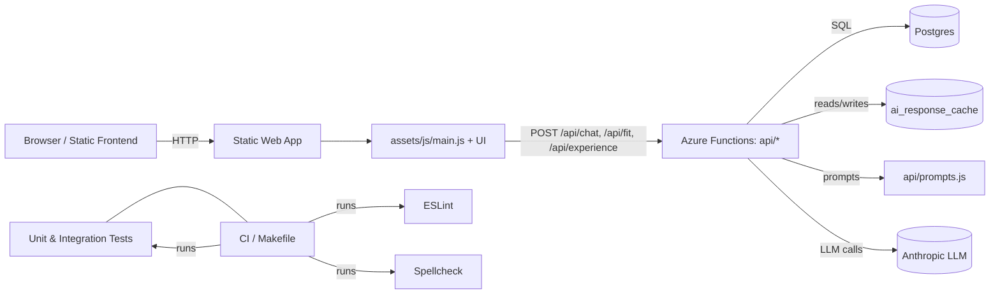
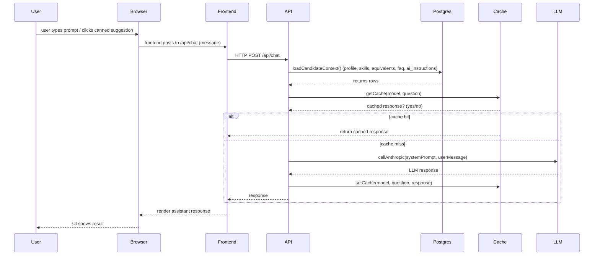
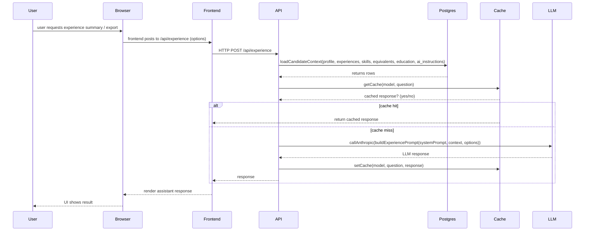
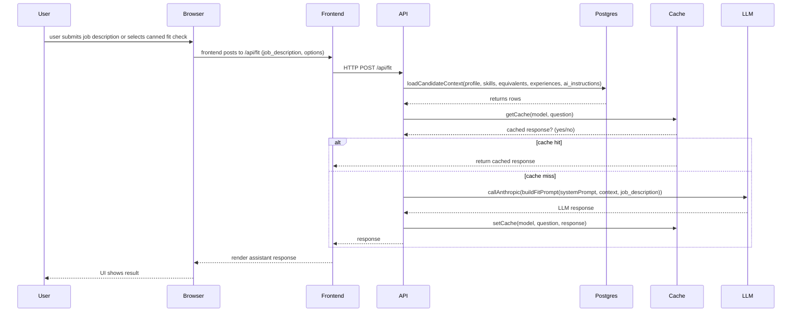
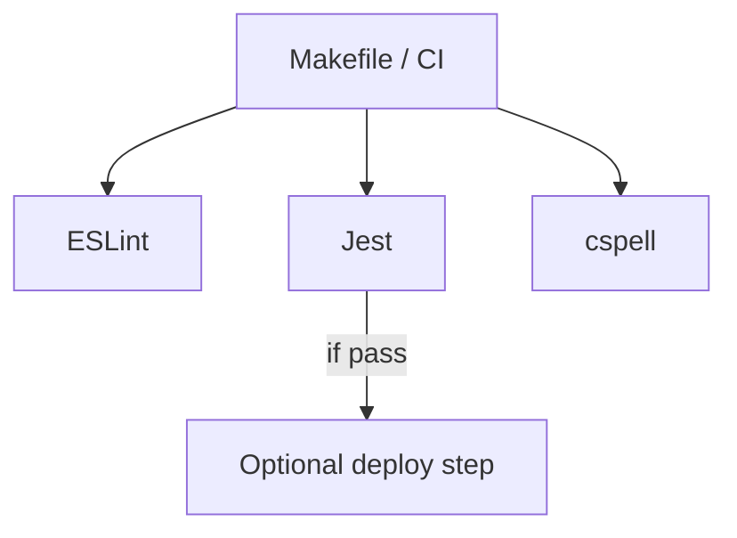
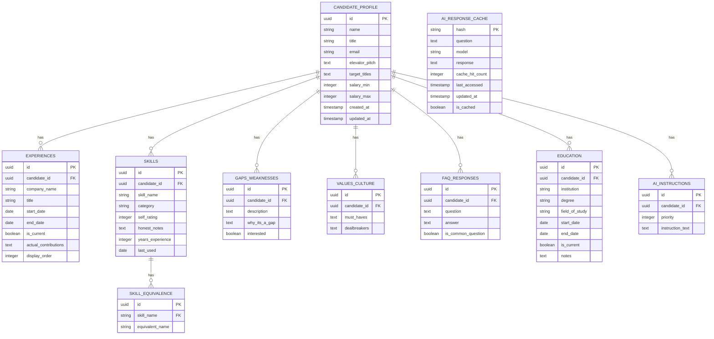

## Design Overview

**Purpose:** Describe the high-level architecture, data flows, security and operational considerations for the `me` site, focusing on LLM integration, prompt centralization, caching, and CI quality gates.

**Scope:** frontend static site + Azure Functions API (chat/fit/experience), Postgres DB, ai_response_cache, prompt builders (`api/prompts.js`), and the Anthropic LLM provider.

---

**Architecture (high-level)**

**Key components**
- Frontend: static pages, UI wires to `/api/*` endpoints in `assets/js/*`.
- API: Azure Functions endpoints in `api/` (chat, fit, experience). Centralized prompt builders live in `api/prompts.js`.
- DB: Postgres holds candidate_profile, skills, skill_equivalence, ai_response_cache, etc.
- LLM: Anthropic-style API used via `callAnthropic()` wrapper with retry/backoff and timeout handling.
- Cache: `ai_response_cache` table keyed by SHA-256 of model+question to reduce LLM calls.

---

## Request Sequence

This sequence shows a typical chat request lifecycle.

### Experience Request Sequence

### Fit Check Request Sequence

## Prompting & Privacy
- Centralized prompt builders: `api/prompts.js` — all prompt text and helper logic lives here to make tuning and audits straightforward.
- Prompt length guard: code trims equivalents or other optional context when prompt size exceeds configured chars (to avoid token limits).
- Sensitive fields: salary and contact details should NOT be included in prompts. Existing code was audited — `target_titles` is included per request, but `salary_min` / `salary_max` are not included. Redact any sensitive profile fields before logging or caching.

## Caching
- Cache entries keyed by SHA-256(model + "|" + question).
- On cache hit: update `cache_hit_count` and `last_accessed`.
- Cache invalidation: manual invalidation endpoint exists (`/api/cache-report` usage); consider TTL-based expiry for long-term scaling.

## Reliability & Backoff
- `callAnthropic` uses retries with exponential backoff for transient 429/503/529 responses and an AbortController for timeouts.
- Timeouts and retries are configurable via constants in each handler.

## Quality & CI
- `Makefile` defines `make lint` (ESLint), `make unit-test` (Jest), `make spellcheck` (cspell), and `make check` that runs all gates.
- `package.json` includes `lint` and `lint:fix` scripts. The linter run has been tuned to ignore test directories during linting as required.

## Security & Logging
- Avoid logging full profile objects; redact or omit `salary_*` and contact fields in logs.
- Cache entries should not leak PII; do not include full profile in cache keys — cache is keyed by model+question only.

## Operational Notes
- Monitor LLM latencies and cache hit ratio; surface metrics in app logs.
- Keep `ANTHROPIC_API_KEY` and `DATABASE_URL` in environment (not source).
- Consider rate-limiting/quotas on endpoints that trigger LLM calls.

## Testing & Local Development
- Unit tests exist under `api/__tests__` (Jest). Run via `npm test` at repo root and `cd api && npm test` for API tests.
- Linting: `npm run lint` and auto-fix `npm run lint:fix`. `make check` includes linting as a gate.

---

If you want, I can: (a) add a diagram for the database schema, (b) generate a simple runbook for LLM incidents, or (c) open a PR with this `docs/DESIGN.md` file.

---

## Database Schema (ER diagram)

The following Mermaid ER diagram summarizes the primary tables and relationships used for candidate context, skills/equivalences, and the AI response cache.

Notes:
- `AI_RESPONSE_CACHE` is global (hash of model + question) to maximize reuse across requests. Be careful not to include PII in cached responses.
- `skill_equivalence` stores textual equivalents for a canonical skill name to aid prompt generation and matching.
- Replace any remaining `SELECT *` usage in handlers with explicit column lists when exposing public endpoints.
